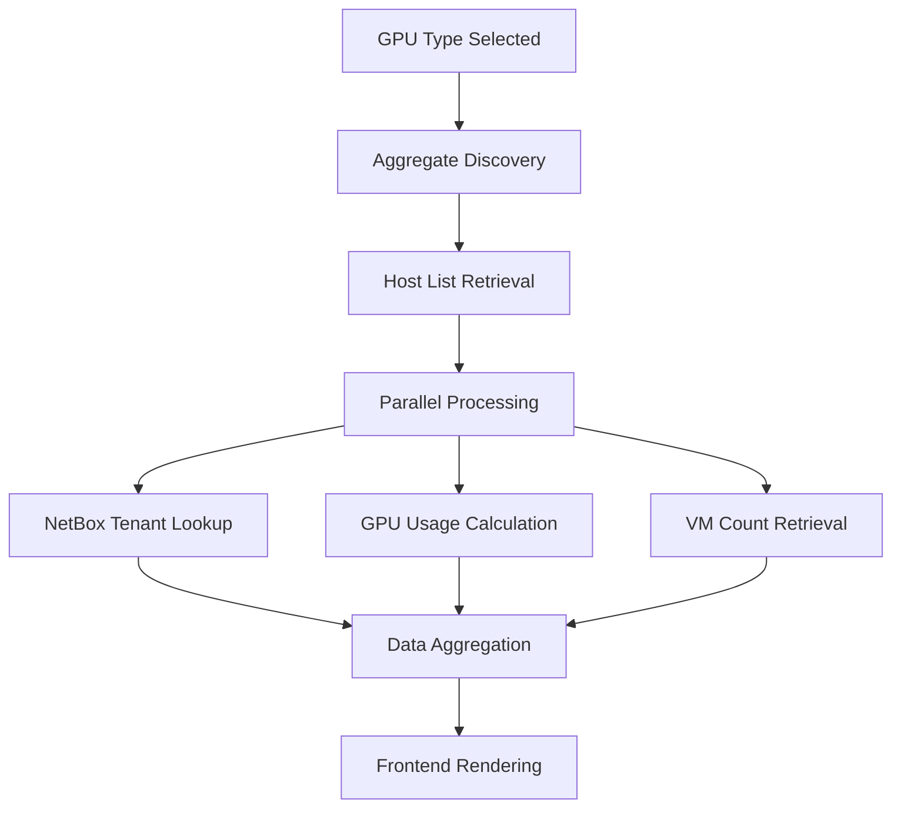
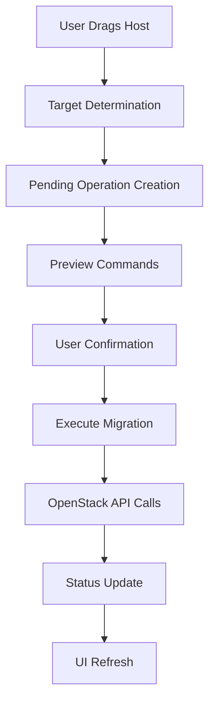
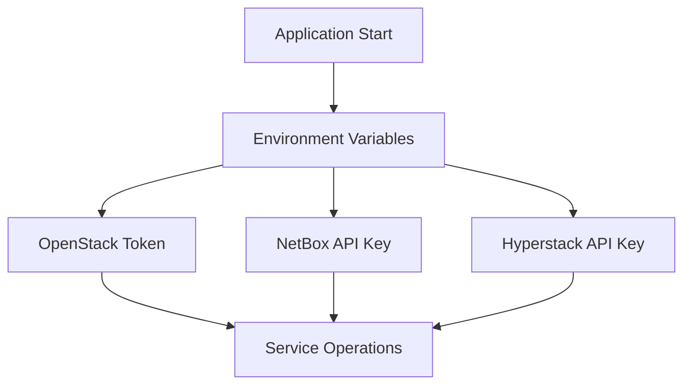

# Architecture Overview - OpenStack Spot Manager

This document provides a comprehensive technical overview of the OpenStack Spot Manager system architecture, component interactions, and design decisions.

## System Architecture Overview

```
┌─────────────────────────────────────────────────────────────────────────────────┐
│                           OpenStack Spot Manager                               │
│                          Web Application Frontend                              │
├─────────────────────────────────────────────────────────────────────────────────┤
│  Browser (HTML5 + Bootstrap + JavaScript Modules)                             │
│  ┌─────────────┐ ┌─────────────┐ ┌─────────────┐ ┌─────────────┐             │
│  │ Frontend.js │ │OpenStack.js │ │Hyperstack.js│ │   Utils.js  │             │
│  │    (UI)     │ │(Migrations) │ │ (Launches)  │ │  (Helpers)  │             │
│  └─────────────┘ └─────────────┘ └─────────────┘ └─────────────┘             │
└─────────────────┬───────────────────────────────────────────────────────────────┘
                  │ HTTP/AJAX API Calls
                  │
┌─────────────────▼───────────────────────────────────────────────────────────────┐
│                          Flask Application Server                              │
│                               (app.py)                                         │
├─────────────────────────────────────────────────────────────────────────────────┤
│  Route Handlers:                                                               │
│  • /api/gpu-types          • /api/aggregates/<type>                           │
│  • /api/host-vms/<host>    • /api/execute-migration                           │
│  • /api/preview-migration  • /api/execute-runpod-launch                       │
│  • /api/command-log        • /api/openstack/*                                 │
├─────────────────────────────────────────────────────────────────────────────────┤
│  Business Logic Modules:                                                       │
│  ┌───────────────┐ ┌───────────────┐ ┌───────────────┐ ┌───────────────┐     │
│  │aggregate_ops.py│ │ host_ops.py   │ │netbox_ops.py  │ │openstack_ops.py│   │
│  │(Discovery)    │ │(GPU/VM Info)  │ │(Tenant Data)  │ │(Core OpenStack)│     │
│  └───────────────┘ └───────────────┘ └───────────────┘ └───────────────┘     │
└─────────────────┬───────────────────┬───────────────────┬───────────────────────┘
                  │                   │                   │
        ┌─────────▼─────────┐ ┌───────▼───────┐ ┌─────────▼─────────┐
        │   OpenStack API   │ │  NetBox API   │ │  Hyperstack API   │
        │                   │ │               │ │                   │
        │ • Nova Compute    │ │ • Device CMDB │ │ • VM Deployment   │
        │ • Host Aggregates │ │ • Tenant Info │ │ • Network Config  │
        │ • VM Management   │ │ • Owner Groups│ │ • Firewall Rules  │
        └───────────────────┘ └───────────────┘ └───────────────────┘
                  │                   │                   │
        ┌─────────▼─────────┐ ┌───────▼───────┐ ┌─────────▼─────────┐
        │ OpenStack Cloud   │ │ NetBox System │ │ Hyperstack Cloud  │
        │                   │ │               │ │                   │
        │ • GPU Hosts       │ │ • Asset DB    │ │ • VM Infrastructure│
        │ • VM Instances    │ │ • Custom      │ │ • RunPod Platform │
        │ • Spot/OnDemand   │ │   Fields      │ │ • Network Setup   │
        └───────────────────┘ └───────────────┘ └───────────────────┘
```

## Component Architecture

### Frontend Layer

#### JavaScript Module Architecture
The frontend uses a modular JavaScript architecture with clear separation of concerns:

**Core Modules:**
- **`script.js`** - Application coordinator, event handling, initialization
- **`frontend.js`** - UI rendering, DOM manipulation, visual feedback
- **`openstack.js`** - OpenStack API integration, migration operations
- **`hyperstack.js`** - Hyperstack API integration, VM deployment
- **`logs.js`** - Logging system, debug information, analytics
- **`utils.js`** - Common utilities, API helpers, data transformation

**Communication Pattern:**
```javascript
// Global namespace pattern
window.Frontend = { ... };
window.OpenStack = { ... };
window.Hyperstack = { ... };

// Event-driven communication
document.addEventListener('hostMigrated', handleMigrationComplete);

// Shared state management
window.aggregateData = { ... };
window.gpuDataCache = new Map();
```

#### UI Components

**Dynamic Column System:**
- Adaptive 5-column layout (Runpod, On-Demand variants, Spot, Contract)
- NVLink detection for On-Demand column splitting
- Responsive design with Bootstrap grid system
- Drag-and-drop support for host migration

**Real-time Data Display:**
- GPU utilization progress bars
- Host status indicators (Available/In-Use)
- VM count tracking
- Background data refresh

### Backend Layer

#### Flask Application Structure
```python
app.py                    # Main Flask application
├── Route Handlers        # API endpoint definitions
├── Business Logic        # Core operations and data processing
├── External Integrations # OpenStack, NetBox, Hyperstack APIs
└── Utility Functions     # Helper functions and utilities
```

#### Core Business Logic

**Aggregate Discovery (`discover_gpu_aggregates`)**
```python
def discover_gpu_aggregates():
    """
    Discovers and categorizes GPU aggregates from OpenStack
    Returns: {
        'L40': {
            'ondemand': [aggregate_list],
            'spot': [aggregate_list],
            'runpod': [aggregate_list],
            'contracts': [contract_list]
        }
    }
    """
```

**Host Information Processing (`get_bulk_gpu_info`)**
```python
def get_bulk_gpu_info(hostnames, max_workers=10):
    """
    Concurrent processing of host GPU information
    - Uses ThreadPoolExecutor for parallel execution
    - Extracts GPU usage from VM flavors
    - Calculates host capacity and utilization
    """
```

**Migration Operations (`execute_migration`)**
```python
def execute_migration(host, source_aggregate, target_aggregate):
    """
    Executes host migration between aggregates
    - Validates source and target aggregates
    - Removes host from source
    - Adds host to target
    - Logs operation results
    """
```

## Data Flow Architecture

### GPU Type Discovery Flow
```mermaid
graph TD
    A[Frontend Requests GPU Types] --> B[OpenStack Aggregate Scan]
    B --> C[Pattern Matching]
    C --> D[Categorization]
    D --> E[Return Structured Data]
    
    C --> C1[Regular: GPU-TYPE-n3[-NVLink][-spot|-runpod]]
    C --> C2[Contract: Contract-*]
```

### Host Information Aggregation Flow


### Migration Workflow


## External Integrations

### OpenStack Integration

**API Endpoints:**
- **Nova Compute API**: Host aggregates, VM management, migration operations
- **Keystone Identity API**: Authentication and token management

**Operations:**
```python
# Aggregate Management
conn.compute.aggregates()
conn.compute.add_host_to_aggregate(aggregate, host)
conn.compute.remove_host_from_aggregate(aggregate, host)

# VM Information
conn.compute.servers(all_tenants=True, host=hostname)
conn.compute.get_server(server_id)
```

### NetBox Integration (Optional)

**Purpose:** Device inventory and tenant management
**API Operations:**
```python
# Bulk device lookup
POST /api/dcim/devices/
{
    "name__in": [list_of_hostnames],
    "limit": 1000
}

# Custom field retrieval
device.custom_fields.get('nvlinks_capable', False)
device.tenant.group.name  # Owner group classification
```

### Hyperstack Integration (Optional)

**Purpose:** VM deployment for RunPod workloads
**API Operations:**
```python
# VM Creation
POST /v1/core/virtual-machines
{
    "name": hostname,
    "image": image_id,
    "flavor": flavor_name,
    "user_data": cloud_init_script
}

# Firewall Management
POST /v1/core/sg-rules
```

## Security Architecture

### Authentication Flow


### Security Features

**Credential Management:**
- Environment variable isolation
- No hardcoded credentials
- API key masking in logs and UI

**Input Validation:**
```python
@app.route('/api/execute-migration', methods=['POST'])
def execute_migration():
    data = request.get_json()
    
    # Validate required parameters
    required = ['host', 'source_aggregate', 'target_aggregate']
    if not all(key in data for key in required):
        return jsonify({'error': 'Missing required parameters'}), 400
    
    # Sanitize inputs
    host = data['host'].strip()
    # ... validation logic
```

**Error Handling:**
- Secure error messages without credential exposure
- Comprehensive logging for audit trails
- Rate limiting for external API calls

## Performance Considerations

### Caching Strategy

**Frontend Caching:**
```javascript
// GPU data cache with expiration
window.gpuDataCache = new Map();
const CACHE_EXPIRY = 5 * 60 * 1000; // 5 minutes

// Background preloading
async function preloadGpuData(gpuTypes) {
    for (const gpuType of gpuTypes) {
        if (!isDataCached(gpuType)) {
            loadGpuDataInBackground(gpuType);
        }
    }
}
```

**Backend Caching:**
```python
# NetBox tenant cache
tenant_cache = {}
CACHE_DURATION = 300  # 5 minutes

def get_netbox_tenants_bulk(hostnames):
    # Implement caching logic
    cached_tenants = get_from_cache(hostnames)
    uncached_hostnames = [h for h in hostnames if h not in cached_tenants]
    # ... fetch and cache
```

### Concurrent Processing

**Parallel Host Processing:**
```python
from concurrent.futures import ThreadPoolExecutor

def get_bulk_gpu_info(hostnames, max_workers=10):
    with ThreadPoolExecutor(max_workers=max_workers) as executor:
        future_to_hostname = {
            executor.submit(get_host_gpu_info, hostname): hostname 
            for hostname in hostnames
        }
        # ... process results
```

**Background Operations:**
```javascript
// Non-blocking background loading
async function startBackgroundLoading(currentGpuType) {
    const otherTypes = gpuTypes.filter(t => t !== currentGpuType);
    
    for (const gpuType of otherTypes) {
        // Load in background without blocking UI
        setTimeout(() => loadGpuDataInBackground(gpuType), 1000);
    }
}
```

## Scalability Architecture

### Horizontal Scaling Considerations

**Stateless Design:**
- No server-side session state
- All state managed client-side or in external systems
- RESTful API design enables load balancing

**Database Considerations:**
- Currently uses in-memory caching
- Can be externalized to Redis/Memcached for clustering
- OpenStack and external APIs are the source of truth

**Load Balancing:**
```nginx
upstream openstack_manager {
    server 127.0.0.1:6969;
    server 127.0.0.1:6970;
    server 127.0.0.1:6971;
}

server {
    listen 80;
    location / {
        proxy_pass http://openstack_manager;
    }
}
```

### Performance Monitoring

**Metrics Collection:**
```python
import time
from functools import wraps

def monitor_performance(func):
    @wraps(func)
    def wrapper(*args, **kwargs):
        start_time = time.time()
        result = func(*args, **kwargs)
        execution_time = time.time() - start_time
        
        # Log performance metrics
        app.logger.info(f"{func.__name__} executed in {execution_time:.2f}s")
        return result
    return wrapper
```

**Health Checks:**
```python
@app.route('/health')
def health_check():
    checks = {
        'openstack': test_openstack_connection(),
        'netbox': test_netbox_connection() if NETBOX_URL else None,
        'hyperstack': test_hyperstack_connection() if HYPERSTACK_API_KEY else None
    }
    
    status_code = 200 if all(checks.values()) else 503
    return jsonify(checks), status_code
```

## Deployment Architecture

### Development Deployment
```yaml
# docker-compose.yml
version: '3.8'
services:
  openstack-manager:
    build: .
    ports:
      - "6969:6969"
    environment:
      - FLASK_ENV=development
    env_file:
      - .env
    volumes:
      - .:/app
```

### Production Deployment
```yaml
# Production with Gunicorn
services:
  openstack-manager:
    image: openstack-spot-manager:latest
    command: gunicorn -w 4 -b 0.0.0.0:6969 app:app
    environment:
      - FLASK_ENV=production
    deploy:
      replicas: 3
      resources:
        limits:
          memory: 1G
        reservations:
          memory: 512M
```

### Kubernetes Deployment
```yaml
apiVersion: apps/v1
kind: Deployment
metadata:
  name: openstack-manager
spec:
  replicas: 3
  selector:
    matchLabels:
      app: openstack-manager
  template:
    metadata:
      labels:
        app: openstack-manager
    spec:
      containers:
      - name: openstack-manager
        image: openstack-spot-manager:latest
        ports:
        - containerPort: 6969
        envFrom:
        - secretRef:
            name: openstack-credentials
```

## Monitoring and Observability

### Logging Architecture
```python
import logging
from datetime import datetime

# Configure structured logging
logging.basicConfig(
    level=logging.INFO,
    format='%(asctime)s %(levelname)s %(name)s %(message)s',
    handlers=[
        logging.FileHandler('openstack_manager.log'),
        logging.StreamHandler()
    ]
)

class OperationLogger:
    def log_migration(self, host, source, target, success, duration):
        log_entry = {
            'timestamp': datetime.utcnow().isoformat(),
            'operation': 'migration',
            'host': host,
            'source': source,
            'target': target,
            'success': success,
            'duration': duration
        }
        logging.info(f"Migration: {log_entry}")
```

### Metrics and Analytics
```javascript
// Frontend analytics
const AnalyticsManager = {
    trackOperation: function(operation, success, duration) {
        const metric = {
            timestamp: new Date().toISOString(),
            operation: operation,
            success: success,
            duration: duration
        };
        
        // Send to analytics endpoint
        fetch('/api/analytics', {
            method: 'POST',
            body: JSON.stringify(metric)
        });
    }
};
```

This architecture provides a solid foundation for managing OpenStack GPU resources at scale while maintaining flexibility for future enhancements and integrations.